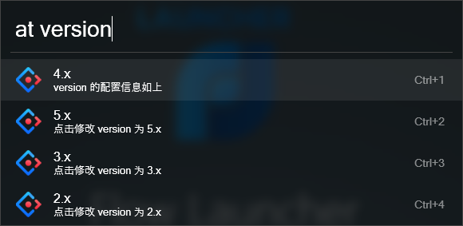
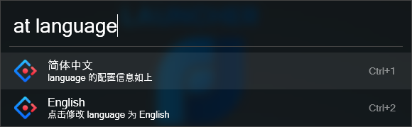
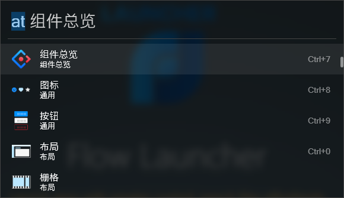
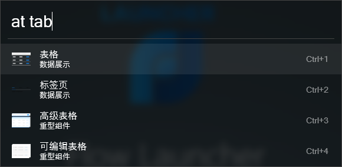
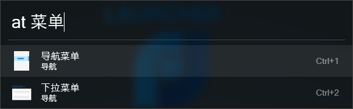
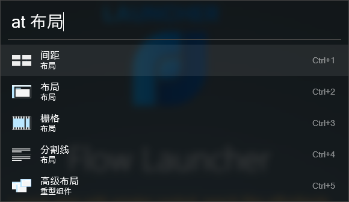

# antd-open-browser

Quickly open the antd component

## Description

A plugin to open the [antd](https://ant.design/) component document in Flow Launcher

## Config

### Set the version of antd



### Set the language of antd



## Usage

### Default display all components



### Search by component name



### Search by component Chinese name



### Search by component category



## Install

### Install with Flow Launcher

```bash
pm install AntdOpenBrowser
```

## TODO

- [x] Add Set the version of antd
- [x] Add Set the language of antd
- [ ] Add Set the base url of antd
- [ ] Integrate configuration items. Unified use of `set` configuration, such as: `at set version`, `at set language`...
- [ ] Automatically filter component libraries based on version. Prevent opening non-existent components in low versions
- [ ] Fix the bug that advanced components cannot be opened
- [ ] The list only displays the Chinese and English names of the components, not the categories of the components
- [ ] Internationalization configuration. According to the set language, display the corresponding prompt information
